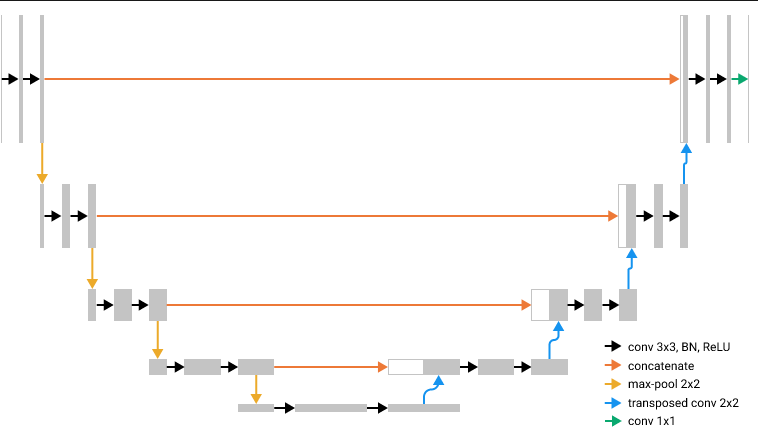
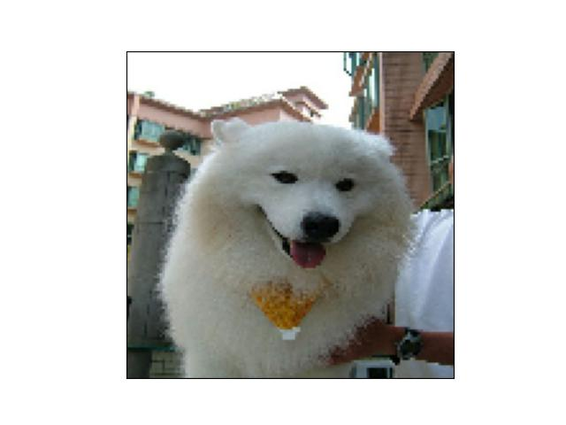
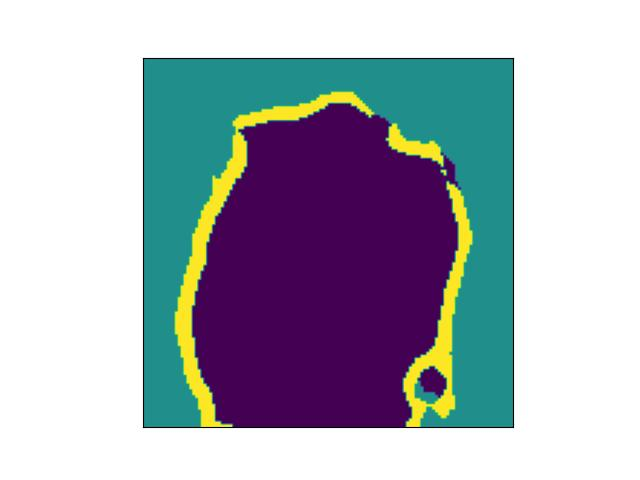
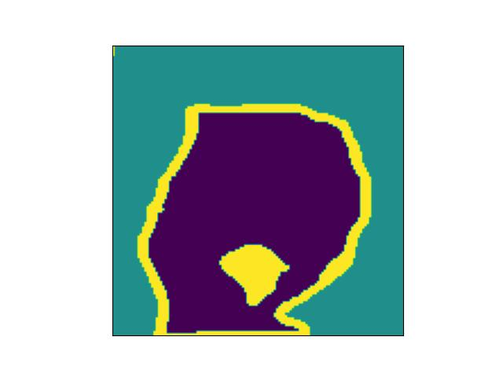
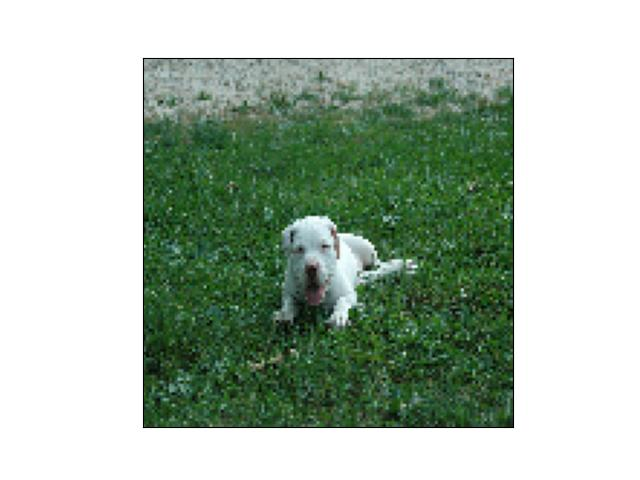
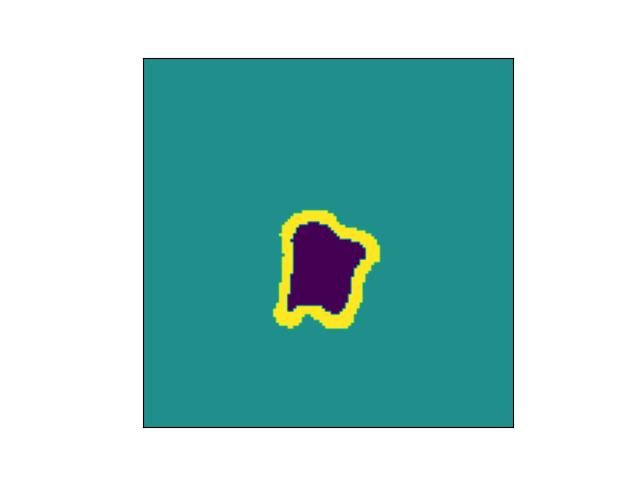
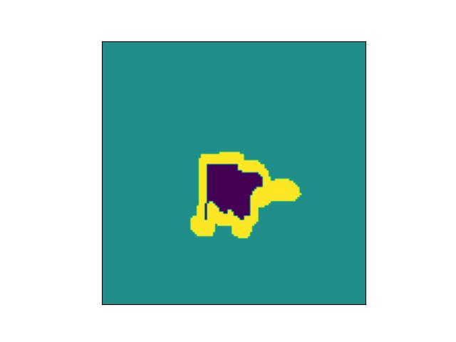
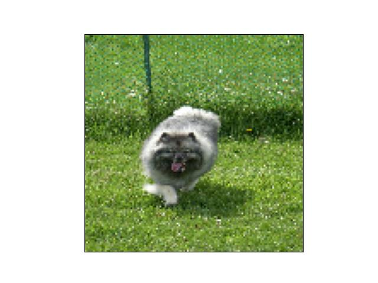
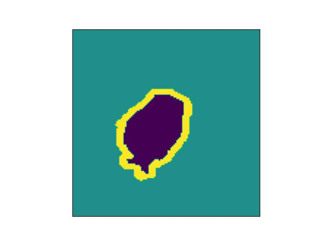

## Semantic_Segmentation_Using_UNet

I wrote an UNet architecture via TensorFlow and trained on it Oxford-IIIT Pet dataset in order to perform semantic segmentation. The "training.ipynb" notebook contains data loading and preprocessing, UNet architecture, training, and evaluation parts.

### Basic Model Architecture

### Evaluation Results

|  | Pet | Background | Outline |
| --- | --- | ---------- | ------- |
| IOU | 0.74 | 0.85 | 0.40 |
| Dice | 0.85 | 0.92 | 0.57 |

### Examples

| Image | Predicted Mask | True Mask |
| ----- | -------------- | --------- |
|  |  |  |
|  |  |  |
|  |  |  |

